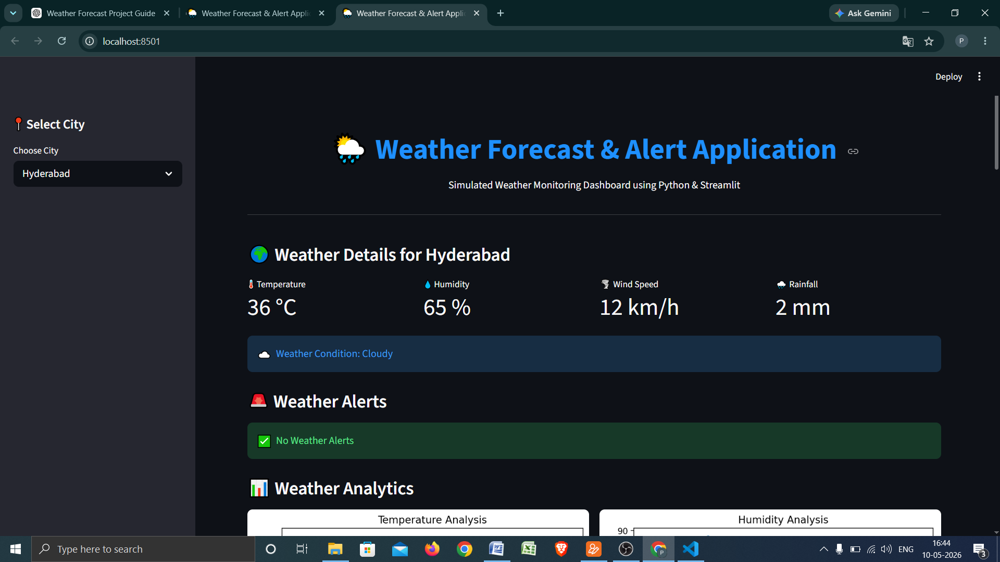
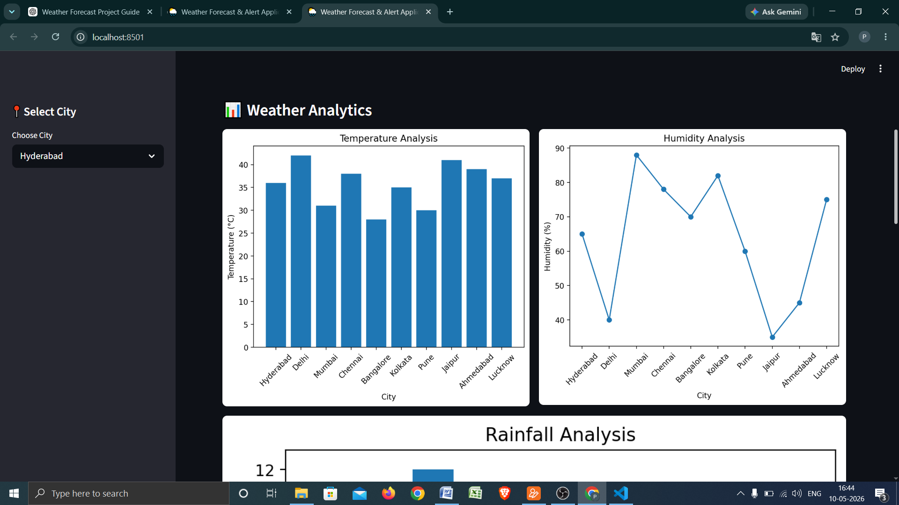
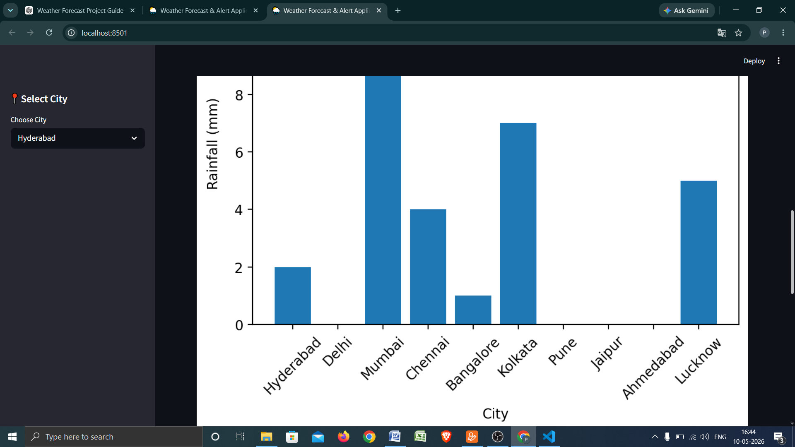
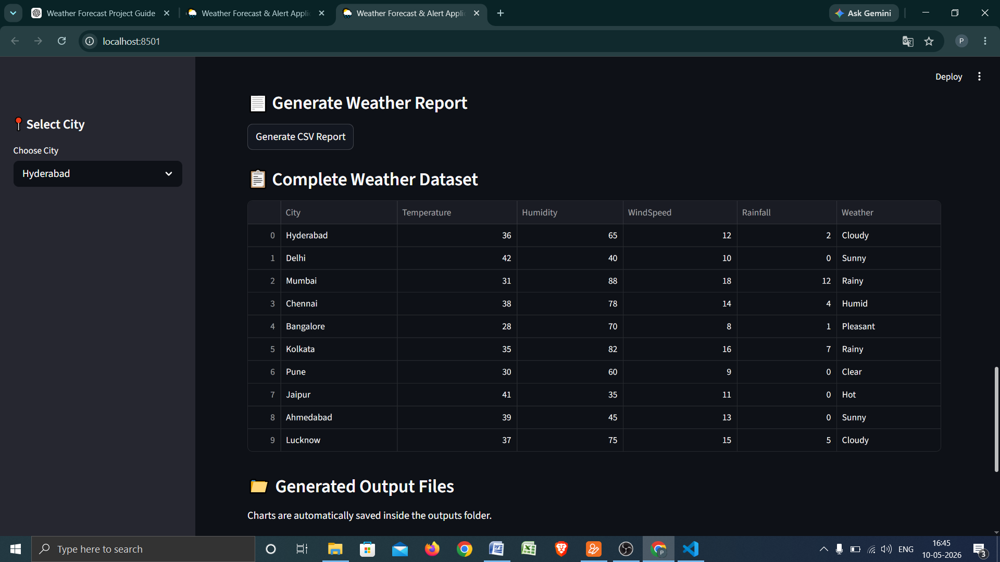
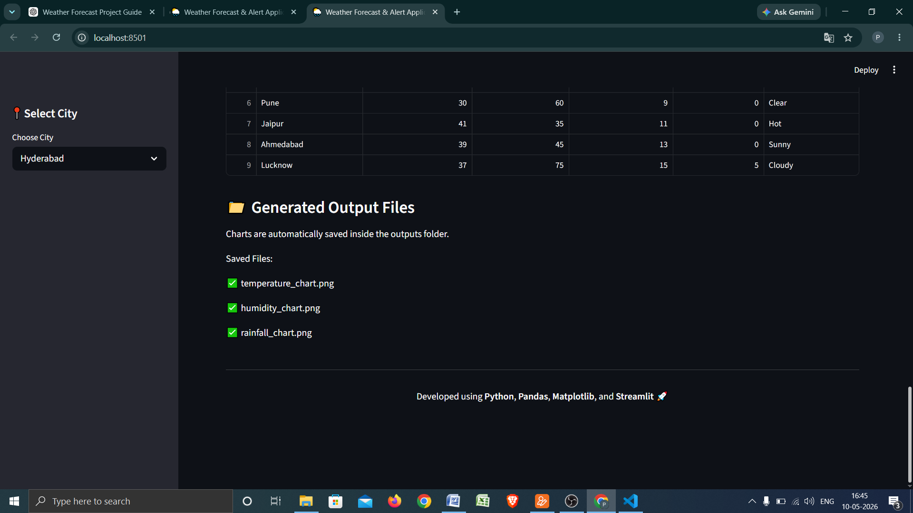

# 🌦️ Weather Forecast & Alert Application

A professional Weather Forecast & Alert Dashboard built using Python, Streamlit, Pandas, and Matplotlib.

This project simulates weather forecasting and alert monitoring without external APIs, making it beginner-friendly and ideal for portfolio projects, GitHub proof-of-work, and Python learning.

---

# 🚀 Features

✅ Weather Monitoring Dashboard  
✅ City-wise Weather Analysis  
✅ Automatic Weather Alerts  
✅ Heat Alert System  
✅ Rain Alert System  
✅ Humidity Alert System  
✅ Wind Alert System  
✅ Interactive Charts & Analytics  
✅ CSV Report Generation  
✅ Automatic Chart Exporting  
✅ Streamlit Professional UI  

---

# 🛠️ Tech Stack

- Python
- Streamlit
- Pandas
- Matplotlib
- CSV Dataset

---

# 📂 Project Structure

```bash
Weather-Forecast-Alert-Application/
│
├── data/
│   └── weather_data.csv
│
├── outputs/
│   ├── temperature_chart.png
│   ├── humidity_chart.png
│   └── rainfall_chart.png
│
├── reports/
│
├── images/
│
├── venv/
│
├── app.py
├── requirements.txt
├── README.md
└── .gitignore
```

---

# 📊 Dashboard Features

- Dynamic City Selection
- Weather Metrics Cards
- Weather Alert Detection
- Temperature Analytics
- Humidity Analytics
- Rainfall Analytics
- CSV Report Downloads

---

# 🚨 Alert Conditions

| Alert Type | Condition |
|---|---|
| Heat Alert | Temperature > 40°C |
| Rain Alert | Rainfall > 5 mm |
| Humidity Alert | Humidity > 80% |
| Wind Alert | Wind Speed > 15 km/h |

---

# ▶️ How to Run Project

## 1️⃣ Clone Repository

```bash
git clone https://github.com/perumalachaitanya/Weather-Forecast-Alert-Application.git
```

---

## 2️⃣ Open Project Folder

```bash
cd Weather-Forecast-Alert-Application
```

---

## 3️⃣ Create Virtual Environment

### Windows

```bash
python -m venv venv
venv\Scripts\activate
```

---

## 4️⃣ Install Libraries

```bash
pip install -r requirements.txt
```

---

## 5️⃣ Run Streamlit App

```bash
python -m streamlit run app.py
```

---

# 📈 Sample Visualizations

The application automatically generates:

- Temperature Charts
- Humidity Charts
- Rainfall Charts

These are saved inside the `outputs/` folder.

---

# 📄 Report Generation

Users can generate CSV weather reports dynamically for selected cities.

Reports are saved inside the `reports/` folder.

---

# 📸 Project Screenshots

## Dashboard Preview



---

## Alerts System



---

## Analytics Charts






---

# 🎯 Learning Outcomes

Through this project, I learned:

- Streamlit Dashboard Development
- Python Data Analysis
- CSV Data Handling
- Alert System Logic
- Data Visualization
- Report Automation
- GitHub Project Management

---

# 🌍 Industry Relevance

This project demonstrates concepts used in:

- Weather Monitoring Systems
- Smart City Dashboards
- Logistics Forecasting
- Environmental Monitoring
- Analytics Platforms

---

# 👨‍💻 Developed By

P.S.Chaitanya Sree

---

# ⭐ Future Enhancements

- Live Weather API Integration
- AI Weather Prediction
- Email/SMS Alerts
- Cloud Deployment
- Real-Time Forecasting
- User Authentication

---

# 📌 Final Output

A complete weather analytics and alert system built using Python and Streamlit for learning, portfolio building, and GitHub showcase.